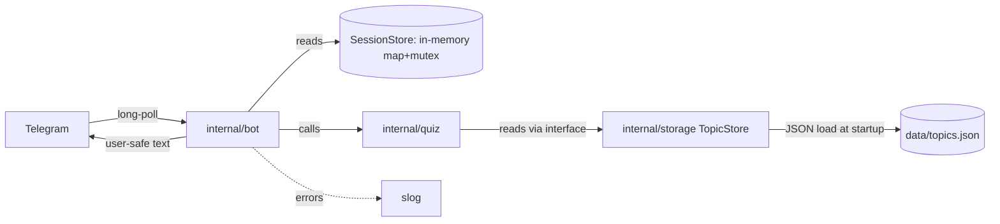

## Target Folder Layout

```
basics/
  cmd/
    bot/main.go              # primary entrypoint, wires layers
  internal/
    bot/                     # bot service layer
      bot.go                 # Run(), handler registration
      handlers.go            # onStart, onCallback*, onQuit, onDefault
      keyboards.go           # categoryKeyboard, orderKeyboard, etc.
      messages.go            # categoryText, questionText, revealText, finalText
      session.go             # SessionStore interface + InMemorySessionStore
    quiz/                    # service / business logic
      topic.go               # Topic struct
      categories.go          # categoryMenu, countInCategory, filterTopics
      options.go             # buildOptions (4-choice generator)
    storage/                 # persistence layer
      store.go               # TopicStore interface
      json_store.go          # JSONTopicStore implementation
    config/
      config.go              # loadDotEnv, mustToken
    errors/
      errors.go              # sentinel errors + UserMessage helper
  cli/                       # DEPRECATED: kept buildable, not used by bot flow
    main.go                  # runCLI + all terminal helpers (moved from main.go)
  data/
    topics.json              # extracted from topics.go
  docs/
    ARCHITECTURE.md          # updated to match reality
  go.mod
  go.sum
```

## Data Flow (Target)



## 1. Extract topics to JSON

- Write a one-off script (or do it manually) to serialize the current `AllTopics` slice in [topics.go](topics.go) into `data/topics.json`. Each entry: `{ "name", "category", "question", "overview", "explanation" }`.
- Delete `topics.go` after the JSON is verified to load and produce identical quiz behavior.

## 2. Persistence layer (`internal/storage`)

```go
type TopicStore interface {
    All() []quiz.Topic
    ByCategory(cat string) []quiz.Topic
}

type JSONTopicStore struct{ topics []quiz.Topic }

func NewJSONTopicStore(path string) (*JSONTopicStore, error) { /* read + json.Unmarshal */ }
```

- Loaded once at startup in `cmd/bot/main.go`. File I/O failure -> fail-fast (`log.Fatal`).
- `ByCategory("")` returns all topics (preserves current "All Topics" semantics from [topics.go:13](topics.go)).

## 3. Quiz package (`internal/quiz`)

- Move `Topic` struct here.
- Move `categoryMenu`, `countInCategory`, `filterTopics`, `buildOptions` from current [topics.go](topics.go).
- Refactor `countInCategory` and `filterTopics` to take a `TopicStore` (or operate on a passed-in `[]Topic`) instead of reading a package-level global. This breaks the hidden global dependency that exists today at [topics.go (filterTopics)](topics.go).
- `buildOptions` already takes a single Topic; just needs access to all-topics for distractors -> pass the store in.

## 4. Session store (`internal/bot/session.go`)

```go
type SessionStore interface {
    Get(chatID int64) *Session
    Reset(chatID int64) *Session
    Delete(chatID int64)
}

type InMemorySessionStore struct {
    mu       sync.Mutex
    sessions map[int64]*Session
}
```

- Port the existing logic from [bot.go:38-66](bot.go) verbatim, just wrapped in the struct.
- `Session` struct (stage, topics, index, score, options, correctIdx, lastMsgID) stays in this same file.

## 5. Bot package (`internal/bot`)

- Move handlers (`onStart`, `onQuit`, `onCallbackCategory`, `onCallbackOrder`, `onCallbackAnswer`, `onCallbackNext`, `onCallbackAgain`, `onDefault`) from [bot.go:302-432](bot.go).
- Move keyboards and message builders unchanged.
- Replace package-level globals (`sessionsMu`, `sessions`) with a `Bot` struct holding `store TopicStore`, `quiz *quiz.Service`, `sessions SessionStore`.
- Handlers become methods on `*Bot` so they have access to dependencies via the receiver (the `go-telegram/bot` library accepts function-style handlers, so we expose `b.OnStart` etc. and register them).
- `Run(ctx, token string)` becomes the public entry called by `cmd/bot/main.go`.

## 6. CLI relocation (`cli/`)

- Move from current [main.go:14-283](main.go) the following into `cli/main.go`: ANSI constants, `clearScreen`, `readKey`, `pressAnyKey`, `wrapText`, `printBanner`, `printCategoryMenu`, `selectCategory`, `printOrderMenu`, `printProgressBar`, `runQuiz`, `printFinalScore`, `runCLI`.
- `cli/main.go` is `package main` with its own `func main() { runCLI() }`.
- Add a top-of-file comment: `// DEPRECATED: kept for reference; the Telegram bot is the active interface.`
- CLI imports `internal/quiz` and `internal/storage` so both paths share one source of truth for topics.
- The current root `main.go` is reduced to nothing - delete it. The bot entry moves to `cmd/bot/main.go`.

## 7. Error policy

- **Logging**: Use `log/slog` (stdlib) initialized once in `cmd/bot/main.go` with a text or JSON handler driven by env (`LOG_LEVEL`, `LOG_FORMAT`).
- **Layers below the bot return errors**: persistence and quiz functions return `(value, error)`, wrapped with `fmt.Errorf("storage: load topics: %w", err)`.
- **Startup errors are fatal**: missing token, missing/invalid `topics.json` -> log + `os.Exit(1)`. This matches the current behavior in [config.go:48-55](config.go).
- **Runtime errors in handlers**:
  - All handler functions follow the pattern: do work -> on error, log with chatID + stage + err, send a friendly fallback message ("Something went wrong, please send /start again").
  - Introduce a small helper `handleErr(ctx, b, chatID, err, userMsg)` in `internal/bot/errors.go` to avoid repetition.
- **Telegram edit failures**: keep the existing fallback in `sendOrEdit` at [bot.go:125-148](bot.go) (try edit, fall back to send new), but log the edit failure at `slog.LevelDebug` instead of swallowing silently.
- **No panics outside `main`**: any recovered panic in handlers logs at `slog.LevelError` and sends the fallback message; never crashes the bot process.
- **Sentinel errors** in `internal/errors/errors.go` for cases the bot needs to react to specifically (e.g. `ErrUnknownCategory`, `ErrInvalidStage`).

## 8. Config + go.mod cleanup

- Move [config.go](config.go) to `internal/config/config.go` unchanged (just package rename).
- Run `go mod tidy` after the refactor so `github.com/go-telegram/bot` is correctly listed as a direct dependency (currently marked `// indirect` in [go.mod:8](go.mod)).

## 9. Update `docs/ARCHITECTURE.md`

- Fix the "WebHook" claim -> the bot uses long-polling via `b.Start(ctx)`.
- Document real package layout (the tree above).
- Document the session store as a real persistence concern.
- Document the error policy section.
- Note the deprecated CLI.

## Execution Order (recommended)

1. Extract `topics.json` from [topics.go](topics.go), verify it parses.
2. Create `internal/quiz` + `internal/storage` packages, move types and logic, compile against a temporary main that just prints topic counts.
3. Move CLI code into `cli/main.go`, make it compile against the new packages.
4. Create `internal/bot`, port handlers + session store, compile.
5. Create `cmd/bot/main.go` wiring everything together.
6. Delete root `main.go`, `bot.go`, `quiz.go`, `topics.go`, `config.go`.
7. Add slog + error helpers per the policy.
8. `go mod tidy`, `go vet ./...`, smoke test the bot.
9. Update `ARCHITECTURE.md`.