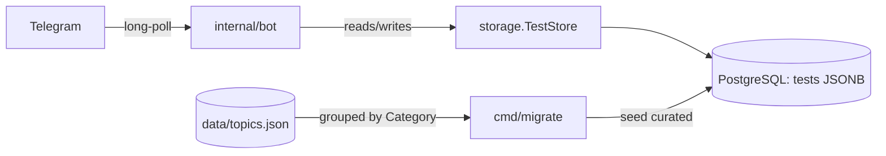

# Customization — Dynamic, User-Managed Tests on PostgreSQL

This document describes the dynamic-tests feature: quizzes are no longer baked
into a read-only JSON file. Instead they live in PostgreSQL, and users can
create, edit, and delete their own tests directly from Telegram.

---

## What a "test" is

A **test** is a named set of quiz questions, stored as a single JSON document.

- **Curated tests** are global (`owner_chat IS NULL`) and shared with everyone. They are read-only and shipped via the migration command.
- **User tests** belong to the chat that created them (`owner_chat = chatID`). Only the owner can see, edit, or delete them.

Each question keeps the existing `quiz.Topic` shape (`Name`, `Overview`,
`Question`, `Explanation`, optional `Layer`, `Category`).

---

## Storage model

Tests are stored one row per test, with the questions in a `JSONB` column, so a
whole test set is a single JSON document in the database.

```sql
CREATE TABLE tests (
    id          BIGSERIAL PRIMARY KEY,
    owner_chat  BIGINT,                       -- NULL = curated/global
    title       TEXT        NOT NULL,
    data        JSONB       NOT NULL,         -- { "questions": [ {Name, Overview, Question, Explanation, Layer}, ... ] }
    created_at  TIMESTAMPTZ NOT NULL DEFAULT NOW(),
    updated_at  TIMESTAMPTZ NOT NULL DEFAULT NOW()
);
CREATE INDEX tests_owner_idx ON tests (owner_chat);
```

The table is created automatically on bot startup (`CREATE TABLE IF NOT EXISTS`),
so a fresh database needs no manual setup.

---

## Architecture



The persistence interface is read/write:

```go
type TestStore interface {
    ListAvailable(chatID int64) ([]Test, error) // global + owned by chatID
    ListOwned(chatID int64) ([]Test, error)
    Get(id int64) (Test, error)
    Create(t Test) (int64, error)
    Update(t Test) error            // owner-scoped
    Delete(id, ownerChat int64) error
}
```

`PGTestStore` (in `internal/storage/pg_store.go`) implements it with `pgxpool`.
Ownership is enforced in SQL: `Update` and `Delete` only affect rows whose
`owner_chat` matches the caller.

---

## User experience (Telegram)

| Command / action | Effect |
|---|---|
| `/start` | Shows the test menu (curated + your own; your tests marked 👤) and starts a quiz |
| `/mytests` | Lists your tests, each with ✏️ Edit and 🗑 Delete buttons |
| `/newtest` | Asks for a short description; Claude generates the test |
| ✏️ Edit | Describe a new test to regenerate and replace one of your tests |
| 🗑 Delete → confirm | Permanently removes one of your tests |
| `/settings` | Shows the management help menu |

Distractors for the multiple-choice options are drawn from the same test's own
questions; small tests fall back to placeholder options so the A/B/C/D keyboard
is always well-formed.

### AI test generation

`/newtest` no longer asks for raw JSON. Instead the user describes the test in
plain language (e.g. *"Create me a test with 10 topics about Africa"*) and the
bot calls the Claude API to generate it. See [INSTRUCTION.md](INSTRUCTION.md) for
account and API-key setup.

The Claude client ([internal/ai/claude.go](internal/ai/claude.go)) sends a system
prompt instructing the model to return only a JSON object matching the bot's test
schema:

```json
{
  "title": "Africa Geography",
  "questions": [
    {
      "Name": "Sahara Desert",
      "Overview": "The largest hot desert in the world, covering much of North Africa.",
      "Question": "Which desert spans most of North Africa and is the largest hot desert on Earth?",
      "Explanation": "The Sahara stretches across North Africa... ",
      "Layer": "Geography"
    }
  ]
}
```

The bot strips any stray markdown fences, then validates the result (non-empty
`title`, at least one question, and non-empty `Name`, `Question`, `Overview`, and
`Explanation` per question; `Layer` optional). If generation or validation fails,
the user stays in the "awaiting description" state so they can rephrase and retry.

AI generation is optional: without `ANTHROPIC_API_KEY`, `/newtest` and editing
report that generation is disabled while the rest of the bot keeps working.

---

## Migration: JSON → PostgreSQL

`cmd/migrate` seeds the curated content:

```bash
DATABASE_URL=postgres://... go run ./cmd/migrate
```

It reads `data/topics.json`, groups topics by their `Category`, and inserts one
global test per category. It is idempotent (existing categories are skipped), so
it is safe to re-run. `data/topics.json` stays in the repo as the seed source.

---

## Configuration

Add the database URL alongside the bot token (see `.env.example`):

| Variable | Required | Description |
|---|---|---|
| `TELEGRAM_BOT_TOKEN` | yes | Token from @BotFather |
| `DATABASE_URL` | yes | PostgreSQL connection string |
| `TOPICS_PATH` | no | Seed source for `cmd/migrate` (default `data/topics.json`) |
| `LOG_LEVEL`, `LOG_FORMAT` | no | Logging controls |

See `DEPLOY.md` for Railway-specific steps (adding the PostgreSQL plugin and
running the migration).

---

## Files

| File | Action | Purpose |
|---|---|---|
| `internal/storage/test_store.go` | new | `Test` struct + `TestStore` interface |
| `internal/storage/pg_store.go` | new | PostgreSQL/JSONB implementation |
| `internal/ai/claude.go` | new | Claude (Anthropic) client that generates tests from a description |
| `internal/bot/manage.go` | new | `/mytests`, `/newtest`, edit/delete handlers + AI generation + validation |
| `cmd/migrate/main.go` | new | One-shot JSON → PostgreSQL seeder |
| `internal/config/config.go` | modified | `MustDatabaseURL()`, `ClaudeAPIKey()`, `ClaudeModel()` |
| `internal/bot/bot.go` | modified | `TestStore` + `TestGenerator` wiring, new handler registration |
| `internal/bot/handlers.go` | modified | Test-based quiz flow (`onCallbackTest`) |
| `internal/bot/keyboards.go` | modified | Test menu, manage, delete-confirm keyboards |
| `internal/bot/messages.go` | modified | New prompts and confirmations |
| `internal/bot/session.go` | modified | `stageAwaitNewTest` / `stageAwaitEditTest` |
| `internal/quiz/options.go` | modified | Robust distractors for small tests |
| `cmd/bot/main.go` | modified | Open `PGTestStore`, build optional Claude client |
| `.env.example` | modified | Documents `DATABASE_URL`, `ANTHROPIC_API_KEY`, and all vars |
| `INSTRUCTION.md` | new | How to set up a Claude account and connect the API |

---

## Out of scope (future ideas)

These were considered but intentionally left out of this iteration:

- **Redis-backed session persistence** so in-progress quizzes survive restarts.
- **Sharing** a user test to the global catalogue (would need moderation).
- **Retry/preview loop** showing the generated test before saving.
